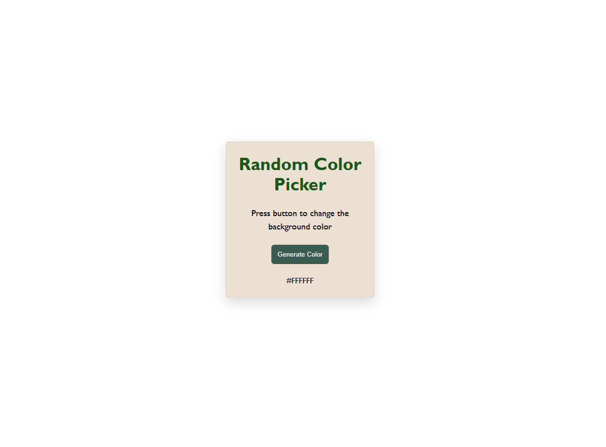
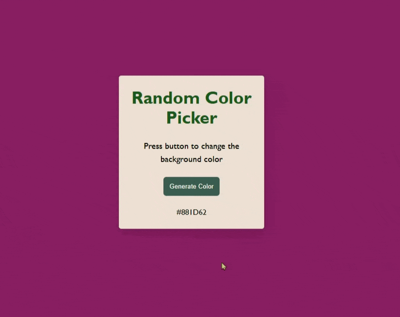

# hex-color-generator

# Random Color Generator 🎨

## About
This project was built to practice DOM manipulation, events, and basic JavaScript logic.

A simple JavaScript project that generates random hex colors and changes the background color of the page.

## Features
- Generates random hex color
- Changes background color dynamically
- Displays hex code on screen

## Technologies
- HTML
- CSS
- JavaScript

## Preview

### Screenshot

### Demo

## Live Demo
https://alpaydevv.github.io/hex-color-generator/
